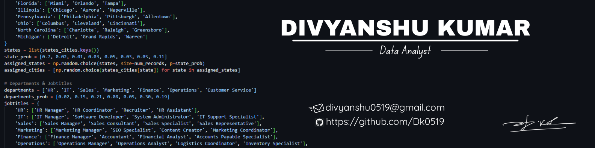

  

<h1 align="center">Hi, I'm Divyanshu Kumar 👋</h1>

  Business Intelligence Analyst | Data Analyst | Python & Power BI Enthusiast

---

## 📊 Summary

🎯 Results-oriented Business Intelligence Analyst with 2+ years of experience in:
- Data Analytics, Visualization, and Automation
- Tools like Power BI, SQL, Python, Tableau, and Excel
- Building real-time dashboards and ETL pipelines
- Driving 20%+ business growth and saving 150+ hours through automation

---

## 🧠 Skills

**Primary Skills:**  
`Data Analytics` | `Business Intelligence` | `Visualization` | `Machine Learning` | `Data Modeling` | `ETL`

**Languages:**  
`Python` | `SQL` | `C/C++`

**Tools:**  
`Power BI`, `Tableau`, `Excel`, `Figma`, `Git/GitHub`, `PostgreSQL`, `MySQL`

**Frameworks & Libraries:**  
`NumPy`, `Pandas`, `Matplotlib`, `Seaborn`, `Plotly`, `Streamlit`, `Scikit-learn`

---

## 💼 Work Experience

### 🔹 Business Analyst — *DuBuddy.in* (Aug 2023 – Present)
- Automated reporting process (saved 150+ hours)
- Built Power BI dashboards for marketing & investment
- Boosted sales by 20%+ and revenue by 46%
- Designed and maintained ETL pipelines

### 🔹 AI/ML Research Intern — *Samsung R&D, Bangalore* (Jul 2022 – Dec 2022)
- Developed real-time Speech Diarization using LSTM/RNN
- Improved model accuracy from 70% to 90%
- Created UAT documentation and model improvements

---

## 📌 Projects

### 🔹 [COVID-19 Global Analysis](https://github.com/Dk0519/Covid_19_Global_Analysis)
- End-to-end data analysis using Python
- Dynamic choropleth maps and regional KPIs
- Automated daily CSV/PNG reports

**Tools:** Python, Pandas, Plotly, Seaborn, Matplotlib

---

### 🔹 [HR Dashboard](https://github.com/Dk0519/Hr_Dashoard)
- Created Python-based pipelines for Tableau dashboards
- Visualized KPIs: hiring trends, salaries, demographics

**Tools:** Tableau, Python, SQL

---

### 🔹 [YouTube Music Song Analysis](https://github.com/Dk0519/YT_Music_Song_Analysis)
- Analyzed 6 years of music trends
- Built Power BI dashboards and automated data flows

**Tools:** Python, SQL, Power BI

---

## 📜 Certifications

- [Google Advanced Data Analytics](https://coursera.org/share/b4efe93ae652198a9026e47585dfe5b9)
- [Google Business Intelligence](https://coursera.org/share/b4efe93ae652198a9026e47585dfe5b9)
- [Microsoft PL-300: Power BI](https://coursera.org/share/b4efe93ae652198a9026e47585dfe5b9)

---

## 🏆 Achievements

- GATE Qualified (AIR 1456 & 1107 – 2024/2025)
- 🏅 5-Star Coder on HackerRank

---

## 📬 Let's Connect

- 🔗 [LinkedIn](https://www.linkedin.com/in/divyanshu0519/)
- 🧑‍💻 [GitHub](https://github.com/Dk0519)
- 🌐 [Portfolio](https://my-portfolio-five-chi-11.vercel.app/)

---

